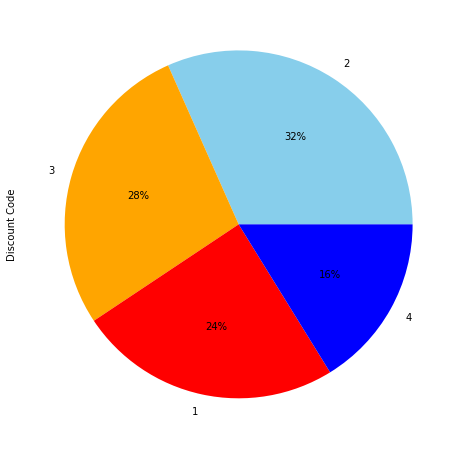
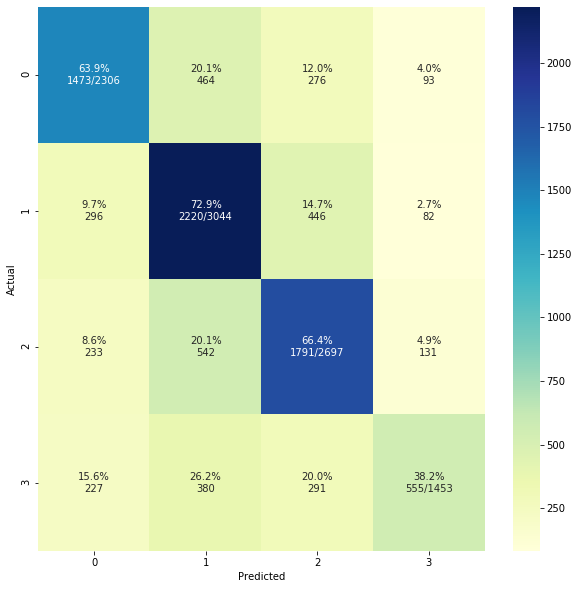
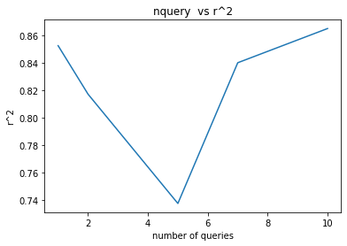

# Hotel_Data_Insights
Machine Learning Final Project 

In this project we use a dataset with over 150,000 entries based on real booking reservations made from various hotels in New York City. Througout the project we use various models and methods in order to predict discount codes.

 

## Our work is integrated of three parts: 
I. Data Processing, preparation and analysis.
II. Classification : Naive Bayes, GaussianNB, XGBOOST, Decision Tree, Random Forest,  Clustering, Neural Network
III. Clustering : Dendogram ward, complete, average and signal.
IV. Active Learning : First we look for a good estimator (oracle) for our semi-supervised data.

 

## Some highlights of our work

 

Target classes are unbalanced.

 

Confusion matrix of our neural network (3 hidden layers).
We can see that the NN gives a better prediction for disc. code 1(code 2) and less sufficent for code 3 (code 4).

 

We can see here that at first our active model is overfitted. That could be because of the lack of examples that correspond to the combinations of hotel name + snapshot date + discount code. Because it's a pool based active model we have to first give him some labels from the pool and thus if the training data is small, our model will be overfitted at first. With each query of our trained oracle (a gini based decision tree with depth of 3) our active model get away from the overfitting due to the generlazation of our oracle.

